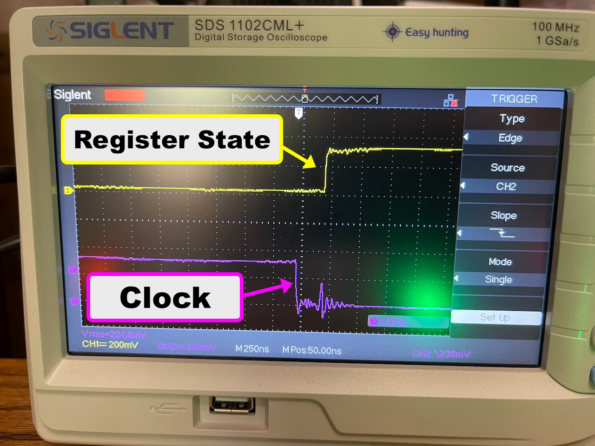

# Advanced Arithmetic Logic Unit
## Overview
I have been building towards this for a while. Back when I started extending my Ben Eater SAP-1 and building my PUTEY-1 computer, I established a goad of doing 64-bit math reasonably efficiently on the 8-bit architecture. This project brings that goal to fruition. 

So the big question is why is this project needed? Could I not do 64 -bit math with the 74LS283-based ALU of the original SAP-1? The answer is I could technically do 64-bit math, but multiplication and division would be extremely inefficient. The reason being is that both multiplication and division would have to be implemented as addition and subtraction loops (respectively) and for larger numbers, those loops will be slow. While there is a [clever tricks to squeeze some more performance out of the 74LS283s for multiplication](https://hackmd.io/@wmvanvliet/SJHhPqr4c), it doesn't address division and I also desired a more robust set of features.

The complete set of features I desire to implement with this project:

* Add and subtract instructions have a "with carry" version
* The AND, OR, and XOR logical operations
* Be able to shift and rotate values left or right, optionally "with carry".
* A "test bit" instruction will test a 8-bit source and set the Z flag accordingly. 
* A general compare operation that can determine equality and magnitude differences.
* Ability to write flags register to data bus and be read by other entities on data bus, notably pushing the value on the stack.

## Design
### Chip Selection
The core of this project centers around the 74LS382 arithmetic logic unit. One might ask why I didn't go with the redo-popular 74LS181. Honestly, I can't make heads or tails of all of its logic functions and how they map to my goals above. The 74LS382 very cleanly has an addition, subtraction, logical AND, logical OR, and logical XOR operation, making its use quite simple in the PUTEY-1 architecture. Another benefit of the 74LS382 is that in addition to having a carry flag, it has an overflow flag. 

For bit shifting, I went with the 74LS194 bidirectional shift register. An attractive aspect of these chips is that they have separate input and output pins, plus loading the input is clocked. In this way they are much like the 74LS173 registers used widely in the PUTEY-1 already. Given that, I use that 74LS194 to back the `A` register too. This makes the `A` register central to the operations of the ALU. To enable both shifts and rotations, the left and right serial input pins are connected to the right-most and left-most output bits, respectively, or with the carry flag. Whether the opposite output bits or the carry Flagg is used to populate the serial inputs with a value is moderated by logic gates connected to various control lines.

At the heart of the comparison operations is the 74LS682 magnitude and identity comparator. I use this chip twice, once with the 74LS382 logic units to be able to easily detect zero-valued results of a logic operation, and then once to provide a general capability to compare the value on the a data bus to either zero or another 8-bit value stored in the temp register. Using this chip to compare 8-it values to zero is much easier than the NOR/AND combination that I used previously. Also used in the comparison unit is a 74LS151 8-to-1 data selector. This chip makes it easy to test the value of a given bit on the data bus. The it number being test is selected by the least significant 3 bits of the temp register, and the zero flag gets set of the bit value is zero. I decided to go with setting the zero flag in order to keep the semantics of the zero flag consistent and keep the number of flags PUTEY-1 has to a minimum. In order to allow branching if the bit value is one, I just need to create a `jnz` "jump if not zero" instruction in the microcode.

Finally, I make use of the ATF22V10C programable logic device in this build. In order to effective the logic of how the control lines would control the various aspects of this ALU, may discrete logic gates would be needed. While part of the charm of this project is to use discrete logic gates where possible, I just felt this project required too many. A programmable logic device allows you to program the logical relationship between a set of input pins and a set of output pins. You could think of these devices as something similar to an EPROM, but they are much faster and use logical relationships to describe the input-to-output relationships as opposed to data. Furthermore, a certain set of pins on these devices can be programmed to be with  input or output pins. In that sense, they are much better suited than EPROMS to consolidate discrete logic gates. I use two of these devices, one to manage the control lines going into the ALU, and one to arbitrate the various flags. These chips are programmed with `PLD` files [as described here](./pld-files/).

#### Data Sheets
The data sheets for key ICs used in this build:

* [74LS382 Arithmetic Logic Unit](./datasheets/74LS382.pdf)
* [74LS682 8-bit Magnitude/Identity Comparator](./datasheets/sn74ls682.pdf)
* [74LS194 4-bit Bidirectional Shift Register](./datasheets/sn74ls194a.pdf)
* [74LS151 8-to-1 Data Selector](./datasheets/74LS151.pdf)
* [ATF22V10C Programmable Logic Device](./datasheets/ATF22V10C.pdf)

### Flags
There are now four status flags on the system that provide input to the control logic. Some of these flags have slight different means depending on what unit set it. The flags and how they are set are:
* `ZF` - **zero** - Set when the results of a math or logic operation results in a zero value, when data bus value being tested is zero, or when the bit being tested is equal to zero.
* `CF` - **carry** - Set when the addition math operation results in a carry, the subtraction math operation does not require a borrow, or when the left or right shift operation in the A register shifts a one-valued bit out.
* `OF`  - **overflow** - Set when the math operation of the `74LS382` results in an overflow or when the compare operation indicates that the left hand value (the value in the temp register) is greater than the right hand value (the value being read from the data bus).
* `EF` - **equal** - Set when compare operation indicates both values (temp register and value on data bus) are equal. 

One flag that is not present that one frequently sees in these sort of projects is the negative flag, set if bit 7 of a value it equal to 1. I did not implement it here because I don't yet see the use case and if I ever did need it, the bit testing functionality being implemented in this project would fully cover that use case (one would just test bit 7). 

### Control Line Assignment
This project continues to use the control logic design introduced in the [8-Bit Instruction Register project](../instruction-register-8-bit/), however the control line assignments are redone some. The control line assignments are:

| Control Line Position | Bank | Group | Symbol | Notes |
|:-:|:--|:--|:-:|:--|
|1 | Left | Direct | `HILO` | Indicates which byte of a 16-bit register is being operated on |
|2 | Left | Direct | `PCa` | Write program counter value to address bus |
|3 | Left | Direct | `ARa` | Write memory address register value to address bus |
|4 | Left | Direct | `SPa` | Stack pointer address activate |
|5 | Left | Direct | `HLa` | `HL` register address activate |
|6 | Left | Direct | `AOa` | Write Address Offset results to address bus adder |
|7 | Left | Direct | | *unused* |
|8 | Left | Direct | `AOi` | Address Offset register in from data bus |
|9 | Left | Direct | `PCi` | Read data bus value into single program counter byte indicated by `HILO`, or address bus value if `DSs` is selected |
|10 | Left | Direct | `IRi` | Read data bus value into instruction register |
|11 | Left | High | `MDi` | Memory device read from data bus |
|12 | Left | High | `Ai` | Read data bus value into `A` register |
|13 | Left | High | `Ti` | Read data bus value into temp register |
|14 | Left | High | `HLi` | Read data bus value into single `HL` register byte indicated by `HILO` |
|15 | Left | High | `Ii` | Read data bus value into `I` register |
|16 | Left | High | `Ji` | Read data bus value into `J` register |
|17 | Left | High | `ARi` | Read data bus value into single memory address register byte indicated by `HILO` |
|18 | Left | Low | `PCe` | Activate program counter increment |
|19 | Left | Low | `ARe` | Activate memory address register increment |
|20 | Left | Low |  `SPe` | Increments stack pointer value,  or decrements when `SUB` is active |
|21 | Left | Low | `Ie` | Activate register `I` increment, or decrement when `SUB` is active  |
|22 | Left | Low | `Je` | Activate register `J` increment, or decrement when `SUB` is active |
|23 | Left | Low |  `HLe` | `HL` register increment enable |
|24 | Left | Low | |  *unused* |
|25 | Right | Direct | `SUB` | Indicates whether the increment operation should instead be a decrement operation |
|26 | Right | Direct | `CRY` | Use carry flag to ALU operation |
|27 | Right | Direct | `S0` | ALU control bit `S0` |
|28 | Right | Direct | `S1` | ALU control bit `S1` |
|29 | Right | Direct | `S2` | ALU control bit `S2` |
|30 | Right | Direct | `S3` | ALU control bit `S3` |
|31 | Right | Direct |  | **Reserved:** `INTr` (reset interrupt status) |
|32 | Right | Direct |  | **Reserved:** `INTi` (load interrupt status) |
|33 | Right | Direct | `AP1` | Add 1 to value on address bus |
|34 | Right | Direct | `ABo` | Write the byte indicated by `HILO` of the address bus to the data bus |
|35 | Right | High | `MDo` | Memory device output to data bus |
|36 | Right | High | `Ao` | Write contents of `A` register to data bus |
|37 | Right | High | `To` | Write at the temp register to the data bus |
|38 | Right | High | `Fo` | Writes the Flags register to the data bus |
|39 | Right | High | `Io` | Write contents of `I` register to data bus |
|40 | Right | High | `Jo` | Write contents of `J` register to data bus |
|41 | Right | High | `∑o` | Write the results of the ALU operation to data bus |
|42 | Right | Low | `SCr` | Resets both the step counter and the extended instruction bit. A step counter overflow needs to do the same thing. |
|43 | Right | Low |  `SPr` | Reset stack pointer to "empty stack" value |
|44 | Right | Low |  `DSs` | Data source input select for 16-bit registers that can load from either address or data bus. LOW is data bus, HIGH is address bus. |
|45 | Right | Low | `CMPs` | Write the temp register to the comparison unit |
|46 | Right | Low | | *unused* |
|47 | Right | Low |  `XTD` | Activate extended instruction bit and resets the step counter. |
|48 | Right | Low | `HLT` | Halt the system clock |

The significant changes over the last project are:

* `CRY`, `S0`, `S1`, `S2`, and `S3`, `CMPi` control bits are added to manage the ALU through the gate array logic. 
* The `∑f` control line for controlling when the flag register reads in flags from the ALU is replaced by the ALU control bits.
* `If` and `Jf` flags control lines removed. Now, microcode will use the comparison unit to test for zero in the `I`, `J`, and `HL` registers during increment and decrement operations.
* `Fo` flags out control line added
* The `SUB` signal is now relevant only to decrement operations in the `I`, `J`, and `HL` registers.
* The `XTD` control line was moved to one of the 74HCT236 banks since in its currently implementation it will never need to be active when another control line is active.

### Gate Array Logic
The detailed programming of the ATF22V10C chips to implement each of the following applications can be views in the [`pld-files` directory](./pld-files/). Below is only an overview of what each chip's programming is intended to accomplish.

#### ALU Instruction Control Line Configurations
The gate array logic for the ALU controller is configured such that the following control line configurations effect the indicated operation:

| Operation | Description | `CRY` | `S0` | `S1` | `S2` | `S3` | `CMPs` | Flags Set? |
|:--|:--|:-:|:-:|:-:|:-:|:-:|:-:|:-:|
|`add`| Add temp value to `A` register | 0 | 1 | 1 | 0 | 0 | 0| `ZF`, `CF`, `OF` |
|`addc`| Add temp value and carry flag to `A` register | 1 | 1 | 1 | 0 | 0 |0| `ZF`, `CF`, `OF` |
|`sub`| Subtract temp value from `A` register | 0 | 0 | 1 | 0 | 0 |0| `ZF`, `CF`, `OF` | 
| `subb` | Subtract temp value from `A` register with carry flag used to indicate whether borrow was taken from `A` when `CF` = 0 | 1 | 0 | 1 | 0 | 0 |0| `ZF`, `CF`, `OF` |
| `and` | AND temp value with register `A` | 0 | 0 | 1 | 1 | 0 |0| `ZF` |
| `or` | OR temp value with register `A` | 0 | 1 | 0 | 1| 0 |0| `ZF` |
| `xor` | XOR temp value with register `A` | 0 | 0 | 0 | 1 | 0 |0| `ZF` |
| `lsr` | Logical shift right register `A` | 0 | 0 | 1 | 0 | 1 |0| `CF` |
| `lsrc` | Logical shift right register `A` with carry flag filling in leftmost bit | 1 | 0 | 1 | 0 | 1 |0| `CF` |
| `lsl` | Logical shift left register `A` | 0 | 1 | 0 | 0 | 1 |0| `CF` |
| `lslc` | Logical shift left register `A` with carry flag filling in rightmost bit | 1 | 1 | 0 | 0 | 1 |0| `CF` |
| `rotr` | Rotate bits in register `A` right one | X | 0 | 1 | 1 | 1 |0| - |
| `rotl` | Rotate bits in register `A` left one | X | 1 | 0 | 1 | 1 |0| - |
| `cmp` | Determine whether left hand value (placed in temp) is equal to or greater than of the data bus value | X | 1 | 1 | 1 | 1 | 1 | `OF`, `EF` |
| - | Determine whether the data bus value is zero. *Not an actual instruction, but used in other instructions.* | X | 1 | 1 | 1 | 1 | 0 | `ZF` |
| `tstb` | Determine if a data bus bit indicate by lower 3 bits of temp is zero | X | 0 | 0 | 0 | 1 |0| `ZF` |

#### Flag Arbitration
Arbitrating how all the various flag lines are applied to the flags register is the duty of a second ATF22V10C.  This one is programmed to take the the various individual flag lines from the various units, and combine them with the flag enable lines coming our of the ALU controller ATF22V10C, and then enable the current flags register input lines in combination with the flags register load line.  The logic is rather simple: only pass through a flags line when that flags line source is currently enabled.  There are four potential flags sources in the current design, outlined in this table:

| Flag Source | Flags Emitted | Descriptions |
|:-:|:-:|:--|
| `A` Register | `CF` | Indicates when a left or right shift pushes a bit off either side. |
| ALU (74LS382 chip) | `ZF`, `CF`, `OF` | The carry and overflow flags are emitted from the 74LS382 for addition and subtraction operations, and the zero flag is asserted for all operations that result in a zero value. |
| Byte Comparison | `ZF`, `OF`, `EF` | When the `CMPs`, the temp register is compared to the data bus value, assert either overflow *(temp > data bus)* or equal *(temp == data bus)* flags. When `CMPs` is not asserted, the data bus value is compared to zero, asserting the zero flag if it is. |
| Bit Comparison | `ZF` | The lower three bits of the temp register are used to indicate which bit of the data bus to test. If that bit is zero, the zero flag is asserted. |

### Updated Extended Instruction Logic
One of the shortcomings of my 8-bit instruction register project was how I enabled the `XTD` bit. The `XTD` bit effectively made the instruction register a 9-bit instruction space, and this bit would be set by a control line. The unfortunate design element is that when the `XTD` bit got set, the step counter was not itself reset. So, if the `XTD` bit get set on step 2 of an instruction, the first step under the `XTD` bit space would be step 3. The primary issue with the design is that the `SCr` control line is what was used to reset both the step counter and the `XTD` bit.

To address this issue, I updated what the `XTD` control line does. It now not only sets the `XTD` bit, but also reset the step counter. The step counter is reset near the falling edge of the clock after the `XTD` bit is set. That way, the first step with the `XTD` bit is set is step 0. Note that the `XTD` bit still gets reset on `SCr`, step counter overflow, and `CLR`.  To use the `XTD` control line properly in microcode, the XTD control line must be active on both the extended and non-extended version of the instruction step. Because of this, if a new instruction value is not loaded while in the extended steps, the `SCr` control line should be asserted before the extended step that contains the `XTD` control line. Furthermore, the `XTD` control line should not be asserted on step 7 because the hardware will reset the `XTD` bit at the end of step 7. With careful usage, this mechanism can also be used to extend the steps of an instruction from a max usable of 7 useful steps to 11 useful steps. I've got to admit, I am not entirely happy with this design, but it is functional, so we will go with it for now.

### Comparison Unit
The comparison unit is intended to provide general value comparison to the PUTEY-1. The basic design goal is to compare the value on the data bus to a reference value, and then set flags accordingly. There are two parts to the comparison unit implemented. The actual comparison operation is select by the ALU control lines as indicated above.

#### Value Comparison
The value comparison part uses a 74LS682 8-bit comparator to compare the data bus value to either the value in the temp register, or to zero. The 74LS682 as able to magnitude comparison and equality comparison, and this allows this part to set a `ZF` zero flag, `EF` equal flag, or `OF` overflow flag (which in this context means "greater than"). The `CMPs` line selects whether the comparison is being made to the temp register or zero.  When `CMPs` is LOW, the value comparison part compares the bus value to zero setting the `ZF` if it is equal to zero, and when `CMPs` is HIGH, the data bus value is compared to the value in the temp register, setting `EF` if they are equal or setting `OF` if the temp register is greater than the data bus value.

#### Bit Testing
The bit testing part uses a  multiplexer to determine if a specific bit on the data bus is equal to zero or not. The 74LS151 requires a 3 bit value to select which input bit to select. This is provided by the least significant 3 bits of the temp register. Then, the `ZF` zero flag is set if the selected data bus bit is equal to zero.

### Updated Counting Registers `I` and `J`
While I was happy with the `I` and `J` counting registers when I built them, time and use has shown me that they were probably more complicated than they needed to be. Specifically the circuitry to detect zero and carry conditions. In this build, I decided to simplify these registers' implementation by removing the zero and carry detection, and then leverage the comparison unit to detect zero values on increment and decrement operations. This means there is no longer a carry flag generated by the `I` and `J` registers. This is OK, as the carry flag was detected when an increment operation resulted in a zero value. One can just detect the zero value directly.

After removing the circuitry for flag detection, the `I` and `J` registers reduced down to each being two 74LS169 up/down counters and a 74LS245 bus transceiver.

### Updated Memory Map Controller
One thing I noticed as I started writing software for this build is that when the `FL` register writes to the address bus using the `ABo` control line, for certain values it would activate the `MMAPe` control line. While we do what a `MMAPe` control line to assert for certain address bus values, that is only useful when the  control lines are also asserted. So in this build I made a small update to the memory map controller to only assert `MMAPe` control lines when either `MDo` or `MDi` are also asserted.

### Faster Clock
With this build, the PUTEY-1 (beta) is finally ready to do higher order arithmetic. However, to do things like 64-bit multiplications, many iterations are still needed even with using the new bit shifting feature. So, the natural things to do to speed up computation of a computer is to increase the clock speed of the computer. 

To speed up the clock, I simply changed a resistor and capacitor of the clock unit. Using [the schematic of my last update to the clock](../stack-pointer/documentation/clock-module-with-error-halt.png) as a reference, I changed `R1` to 330 Ω, and `C6` to 1 pF. Those two changes yielded an updated clock frequency of about 380 KHz. 

#### Inductance, Capacitance, and Timing ... oh my!
Increasing the clock speed was challenged by the electrical properties of the breadboards used to make the PUTEY-1. As highlighted in previous projects, the inductance and capacitance of the breadboards and the long wires can cause spurious signals and echos in the various lines. This problem was most noticeable in the clock line, which is the longest wire run on the board. 

The below photo shows an example of the problem it caused. In this phot, you see the clock signal in cyan, and a register state in yellow. The register is not supposed to be loading a value, but you can see that it does change value at the same time the clock line has a small fluctuation after the clock value goes low. This fluctuation was enough that the register IC would perceive it as a rising clock signal and trigger what ever action the IC was configured to do, which in this case was to load a value, which was done prematurely. While I'll admit I don't know the detailed cause of this fluctuation, I believe it caused by the inductance on the clock line generating a small current pulse after the voltage and current on the clock line goes to zero. 

I tried two was to address the spurious signals in the clock line, with some success. The two methods used are:

1. I replaced the 74LS04 Inverters used in the clock design with 74LS14 Schmitt Trigger Inverters. This cleaned up the edges of the clock signal significantly. Furthermore, I found that some of the ICs that were most "distant" (at the farthest end of the clock line run) still got dirty edges to the clock signal. So I inserted a second 74LS14 into the clock line near these furthers ICs, and ran the clock through the Schmitt Trigger twice to keep the HIGH/LOW sense. This also cleaned up the edges for these "far" ICs. The double inserting does introduce a phase delay in the clock signal, but for the speeds I am running PUTEY-1 at, these delay is trivial.
2. The above Schmitt Trigger solution did not address the problem identified in the picture above, where a secondary pulse is created after the clock signal goes low. I found [this article on how to suppress noise in digital circuits](https://www.murata.com/en-us/products/emc/emifil/library/knowhow/basic/s2-chapter01-p1). The basic gist of the article is to use a ferrite bead inline with the signal line and in combination with a capacitor between the signal line and ground. Formulas are provided for determining the right value, but I just experimented and came to some values empirically. Using a ferrite bead and capacitor combo solved the clock signal fluctuation identified in the picture above. It id not fully remove the fluctuation, but the fluctuation was suppressed enough to not be perceived as a rising clock edge by connected ICs.

Given the changes identified above, I was able to increase the clock rate significantly, all the way to about 380 KHz. I did try to increase the clock more, but problems arose. Basically, the best I can tell is the CPU is operating fine, but the LCD Display starts to miss characters when the computer is trying to display stuff. I have an idea of why this is happening, but I am happy with the 380 KHz clock for now, so I did not do any further investigation.
