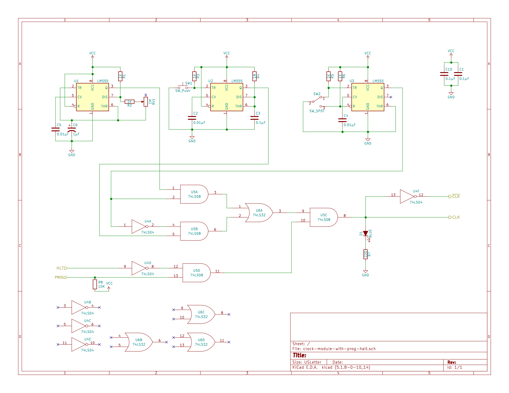

# Clock Halt When Programming
In the original design, the system clock can be halted with either the manual clock switch or the system control `HLT`. However, if you switch the computer to programming mode and order to enter RAM values by asserting the `PROG` signal (which, despite notation, is active low), the system clock may continue running, causing the the computer to continue to iterate through the microcode steps of the current instruction. This can create problems if you happen to switch to programming mode when the computer was on a step that has a "RAM in" step. 

This improvement changes the SAP-1 to simply halt the system clock when switched to programming mode. 

## Design Approach
The `PROG` signal that come from `SW6` in the memory address register module will be what is used to signal the clock to halt. When the run/program switch is set to run mode, the `PROG` signal floats to what ever the `S` inputs of the 75LS157 is pulled to. While ostensibly these chips pull the `S` input high, in practice this has proven to be unreliable to depend on. So one of the modifications of this improvement is to pull the `PROG` line high with a 10K Ω resistor anywhere along the `PROG` line.

When the `PROG` signal is low, the computer is in programming mode. It's this low signal that we want the clock module to cue off of to halt, and when `PROG` returns to high, the clock should honor any other halt inputs. One way to accomplish this is to use the extra AND gates on the 74LS32 chip original found in the clock module to AND together the inverted `HLT` signal and the `PROG` signal. That way, when the the `HLT` signal is low (it gets inverted before the AND gate) and the `PROG` switch is in run mode, thus pulled high, the clock will run. When either the `HLT` signal is asserted high or the `PROG` switch is in program mode, the clock will be in the halted state. 

### Schematic
The updated module is show in this schematic. The changes over the original model are the addition of the `PROG` line from the address register module, the pull up resistor on that line, and AND'ing that line with the inverted `HLT` line using the last remaining AND gate on the 74LS08 chip in the clock module. 

