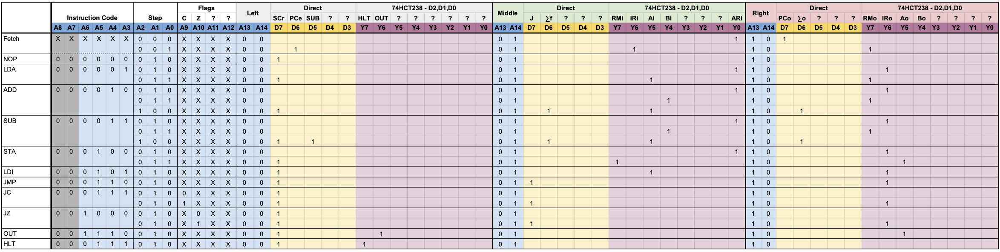

# Expanded Control Logic
## Project Overview
In order to expand the SAP-1 with more modules, more control lines are needed. However, the SAP-1 as designed by Ben Eater only make 16 control lines available, and all of them are used. This project's goal is to add the ability to drive more control lines to the SAP-1. However, this project does not yet make general use of them (with two exceptions), it is more focussed on upgrading the control logic design to enable later expansion.

The specific goals pf this project are:
* Ability to grow the instruction code space and flags used by using EEPROMs with more address lines. 
* Expand the number of control lines by at least 2x.
* Make available to the microcode more steps than 5 as enabled by the 3 bit step counter. This requires the introduction of a "reset steps" control that every instruction with less than 8 steps would need to issue on its last step. 
* Enable the register B out control which is not enabled on the original SAP-1. 

When all done, the SAP-1 with expanded control logic should behave identically to the original SAP-1 with the exception that instructions with fewer than 5 steps will end earlier than before, thus speeding up the computer. 

### SAP-1 Control Signals

The existing SAP-1 control signals are listed below. In order to enable future expansion of the control signals and enhance clarity, new symbols for each control signal are provided.

| Original Symbol | New Symbol |Component | Description |
|:-:|:-:|:--|:--|
| HLT | HLT | Clock | Stop the clock |
| M̅I̅ | A̅R̅i̅ | Address Register | Reads data bus value into memory address register |
| RI | RMi | RAM | Reads data bus value into RAM at current address in address register |
| R̅O̅ | R̅M̅o̅ | RAM | Writes the current RAM value at the current address register to the data bus |
| I̅O̅ | I̅R̅o̅ | Instruction Register | Writes the lower 4 bits of the instruction register to the data bus's lower 4 bits |
| I̅I̅ | I̅R̅i̅ | Instruction Register | Reads data bus value into the instruction register |
| A̅I̅ | A̅i̅ | Register A | Reads data bus value into register A |
| A̅O̅ | A̅o̅ | Register A | Writes value in register A to the data bus |
| ∑̅O̅ | ∑̅o̅ |ALU | Writes current value calculated by ALU to the data bus. |
| SU | SUB | ALU | Sets the ALU operation to subtraction. |
| B̅I̅ | B̅i̅ |Register B | Reads data bus value into register B |
| OI | OUT | Output Display | Reads data bus value into output display register |
| CE | PCe | Program Counter | Enables the program counter to advance by 1 on next clock |
| C̅O̅ | P̅C̅o̅ |Program Counter | Writes the current program counter value to the lower 4 bits of the data bus |
| J̅ | J̅ | Program Counter | Reads the lower 4 bits of the data bus into the program counter's register |
| F̅I̅ | ∑̅f̅ | Flags Register | Reads the current state of the ALU flags into the flags register |

With this project, we will add the following new control signals:

| Symbol | Component | Description |
|:-:|:--|:--|
| B̅O̅ | Register B | Writes value in register B to the data bus |
| S̅C̅r̅ | Control Logic | Resets the microcode counter to step 0 |

## Design

### IC Selection
For the EEPROMs, the 28C256 EEPROM will be used. The 28C256 adds 4 more address lines over the 28C16 used in the original SPA-1 design. This enables later instruction code expansion and more flag lines. 

Control line expansion will be accomplished by both using three EEPROMs rather than just two and then strategically using 3-to-8 decoders on some of the EEPROM data line. Since we want our control lines to be active high, the 74HCT238 is used as the 3-to-8 decoder instead of the 74LS138, which would need an inverter prior to the control line status LED.Using one 74HCT238 with each 28C256 will yield a total of 39 control lines.

Finally, the step counter will be similar in design to the original SAP-1, however since the `SCr` step counter reset is going to be active high, the step counter design is simplified 74HCT238 3-to-8 decoder as all possible step reset signals (the reset button, the maximum step in the step counter, and the `SCr` microcode signal) will now be active high. These signals can then be combined together with OR gates and the final results inverted before being fed into the M̅R̅ signal on the 74LS161 4-bit binary counter.

Data Sheets:
* [74HCT238 non-inverting 3-to-8 decoder](https://www.ti.com/lit/ds/symlink/cd74hct238.pdf)
* [AT28C256 256K EEPROM](https://www.mouser.com/datasheet/2/268/doc0006-1108095.pdf)
* [74LS161 4-bit Counter](https://www.ti.com/lit/ds/symlink/sn74ls161a.pdf)
* [74LS32 Quad OR Gate](https://www.ti.com/lit/ds/symlink/sn74ls32.pdf)
* [74LS04 Hex Inverter](https://www.ti.com/lit/ds/symlink/sn74ls04.pdf)

### EEPROM Address Line Usage
The 15 address lines of the 28C256 EEPROMs will be used as follows:

* Two address lines one the EEPROMs will be added to the instruction code selection for a total of 6. This will allow the instruction set to grow to 64 instructions. Since the original SAP-1 only enables 4 bit instruction codes, the two high bits used for the instruction set will be tied low in this project. 
* Four address lines will be used for control flags. The original SAP-1 only has two control flags, `CF` and `ZF`, so two of these address lines will be tied low in this project.
* Two address lines are needed to select the EEPROM. Since this design will use three EEPROMs, two address lines are needed. Given the use of two address lines, it is feasible to add a fourth EEPROM in the future. 

With three EEPROM address lines used to indicate the microcode step, that accounts for all 15 address lines of the 28C256.

### Bit Layout

Between the three 74LS238 and the balance of the data bits from the three EEPROMs, there is a total of 39 available control signals. One of the considerations that must be made due to the use fo the 74HCT238 3-to-8 decoder is that each 74HCT238 can only activate one control line at a time. So control lines that have the potential of being activated on the same microcode step must be on different 74HCT238s or be on one of the directly exposed 28C256 data lines. 

To enable the original SAP-1 instruction set, the control signals will be laid out in the data bits as follows:

Note that many of the data pins, either directly on a 74c256 or on a 74ls238, are unused. Again, these are for future expansion.

### Electrical Design
The KiCad project containing the electrical schematic for the expanded control logic module [is provided in this repository](./control-logic/). 

### Microcode

TBC

