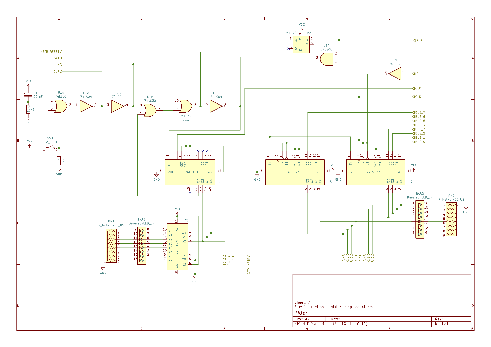
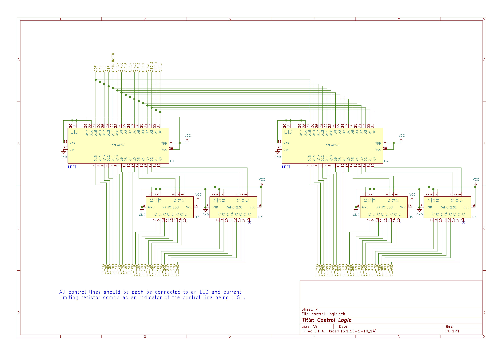
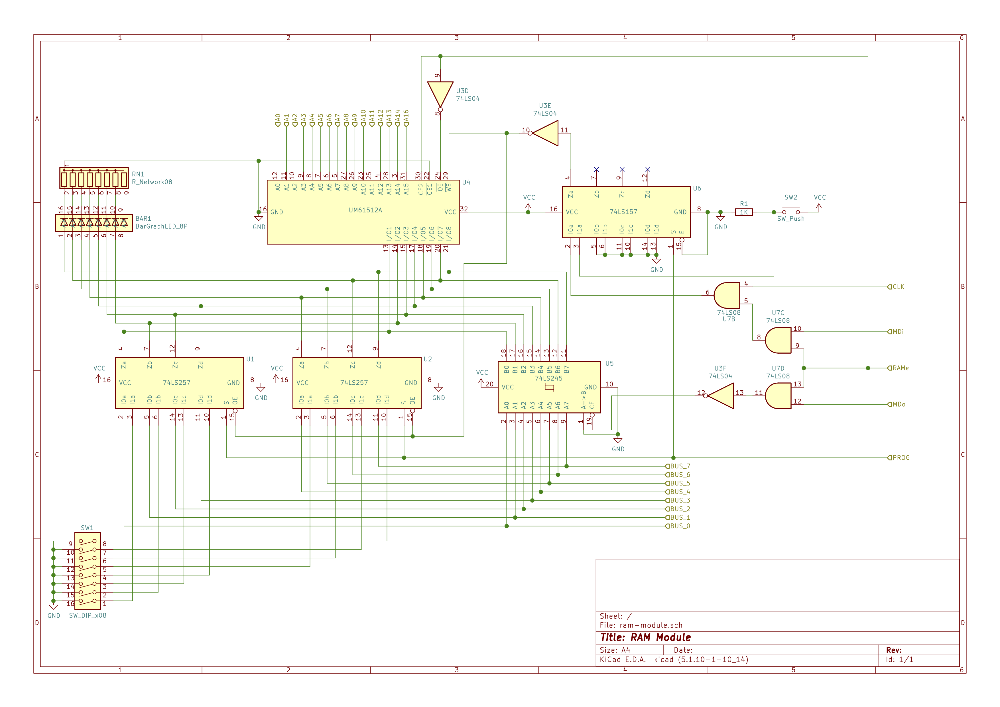
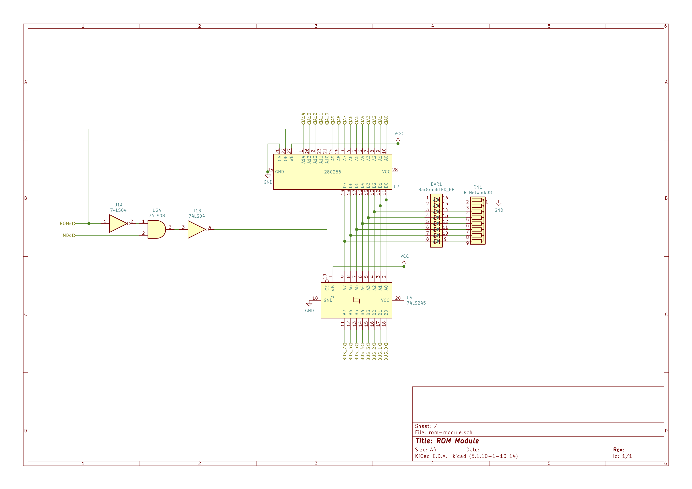
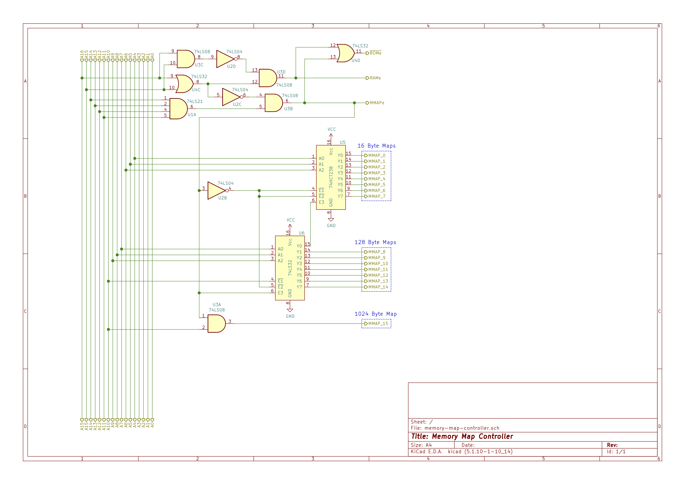
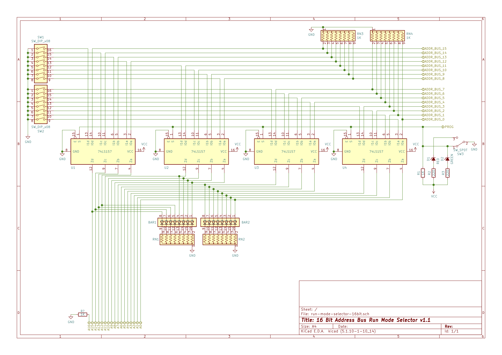

# 8-bit Instruction Register

## Overview
The goal of this project was to do the natural next step of the previous 64K RAM/ROM upgrade and now extend the instruction register to use the full 8 bits, thus enabling at least 256 distinct instructions. To prepare for that, I went ahead and designed an 8-bit instruction set, and in that process, I realized that there were some shortcomings of my breadboard TTL CPU to date, and that I needed to iterate on some of my previous changes. So this project will not only update on the instruction register, but iterate on both the control lines architecture and the memory architecture.


[](https://youtu.be/Oe24BykYX04)

## Design Goals
1. The primary design goal for this change is to enable 8-bit instructions in my breadboard CPU. Furthermore, I would like to enable the ability to implemented extended instructions at least once, thus bringing the total possible instructions to 511. It's doubtful I'd ever use that full scope allowed by extended instruction, but it's be nice to enable.
    * The motivation for using the full 8-bit instruction space is that the instruction can be "parameterize". The idea here is that the first few bits in the instruction byte indicate the actual operation, while the subsequent bits pertain to specific operands. Constructing instruction values in this way will make it easier to enable an assembler for my breadboard CPU's instruction set.
2. Update the control logic to enable the full 8-bit instructions. Furthermore, In preparation for projects yet to come, rework the control logic to also enable more control lines.
    * My prior expansion of the control lines was not forward looking enough and was only sized for 6-bit instructions. As a result, the EEPROMs selected do not have enough address lines to enable 8-bit instruction, and 4 flag lines, and 3 bit steps, and and a few other inputs to the control logic I am thinking about.
3. Iterate on the memory module to enable memory mapped I/O. While this project will not yet fully use the memory mapped I/O, I wanted to put the components for it in while I was restructuring things to address the needed changes in control logic.
    * If I didn't introduce memory mapped I/O into the design, I would need to add more control logic and customize the microcode for every peripheral I would like to add, and a corresponding instruction to use that peripheral. This approach will get out of hand rather soon, if it hasn't already.
4. When designing the implementation of the goals above, be forward thinking about the eventual need to add a stack pointer, upgrade the ALU, add a more sophisticated output display, and add several other capabilities to the system.

# Design

## Instruction Set
To understand the architecture I need to be building towards, I found designing an instruction set be be a very informative exercise. The general approach was to define prefixes to define the type of operation, then bit parameters are appended to the prefix to define variations on that operation.

A good example of this is the `mov` instruction, which is used to copy a value from one location to another. If, for example, we want to copy the value currently in register `A` to register `I`, the assembly instruction would look something like this:
```asm
mov i,a
```
To indicate this in the 8-bit instruction code, there would be a bit prefix to indicate a `mov` instruction, then two bit parameters to indicate both the destination and source registers. For example, something like this:
```
    Byte 0
  ==========
  01 011 001
  -- --- ---
   |  |   |
   |  |   +------------ The byte code 110 indicating the second operand is register A
   |  +---------------- The byte code 011 indicating the first operand is register I
   +------------------- The byte code 01 indicating the mov instruction
```
This then produces a single 8-bit value, `b01011001`, which represents the entire `mov i,a` instruction, and this instruction can then be programmed into the microcode. 

This approach can be extended to instruction that require numeric parameters. For example, consider this `mov` instruction place the immediate value `$F0` into register `A`:
```asm
mov a,$F0
```
In addition to the byte code for the instruction, the machine code will need the second operand's immediate value added to indicate the value. In this case, the bit parameter for the second operand would indicate that an immediate value would follow the instruction's byte, and the overall machine code would be constructed something like this:

```
    Byte 0    Byte 1
  ========== ========
  01 001 111 11110000
  -- --- --- --------
   |  |   |     |
   |  |   |     +------ The second operand's operand value of $F0
   |  |   +------------ The byte code 111 indicating the second operand is a direct value
   |  +---------------- The byte code 001 indicating the first operand is register A
   +------------------- The byte code 01 indicating the mov instruction
 ```

So to flesh out this approach, one just needs to define the instruction prefix bits and the set of operand parameter bits, and which operands would require trailing byte code values. There will be some instructions that do not require operand parameters, such as `HLT`, and some may only require 1 operand parameter.

What came from this is an approach of defining "operand sets" that indicate the various values that can be the operand parameter for any given set of instructions. An important aspect of these operand sets is that depending on the type of instruction, the operand parameter bits are a set width, and thus the set of possible operand values have a set cardinality. For an 8-bit instruction, this limits the design of the actual CPU. For example, you could have a large number of registers in the CPU, but you may not be able to identify them in instructions given the limited bit width afforded in an 8-bit instruction. Of course, this issue could be mitigated by using an 16-bit instruction, but that would require a 16-bit instruction register and the ability for the control logic to be driven by 16-bit instruction. I take an alternate approach for expanding the instruction space beyond what a single 8-bit word affords by using an "extended instructions" approach I describe below.

For the breadboard computer I intend to build, the types of operands sets I will need the following operand sets:

* **8-bit Value Source** - Represents a location from where an 8-bit value could be copied from. Examples include registers, immediate values, and values at specified memory locations. In this build, the values are:
    * `A` register
    * `I` register
    * `J` register
    * Value at specific memory address
    * Value at the memory address contained in the `MAR`
    * Immediate value
* **8-bit Value Destination** - Represents a location to where an 8-bit value could be copied to. Similar to the set of 8-bit Value Sources, but would not include an immediate value destination. In this build, the values are:
    * `A` register
    * `I` register
    * `J` register
    * Value at specific memory address
    * Value at the memory address contained in the `MAR`
* **16-bit Value Source** - These are sources where a 16-bit memory address value can be found. The most common one will be immediate values and 2-byte values that start at an indicated address. In this build, the values are:
    * `MAR` memory address register
    * Value at the memory address contained in the `MAR`
    * Two byte value starting at specific memory address
    * Immediate value
* **16-bit Value Destination** - These are locations where a 16-bit memory address value can be placed. In this build, the values are:
    * `MAR` memory address register
    * Value at the memory address contained in the `MAR`
    * Value at specific memory address
* **Incrementable Destination** - The set of destinations that can be directly incremented or decremented. Examples include [the increment registers I added to the CPU a few projects back](../increment-registers/). In this build, the values are:
    * `I` register
    * `J` register
    * `MAR` memory address register
* **Address Source** -  A subset of 16-bit value sources that can be used to indicate a memory location and have their value written to the address bus.
    * Two byte value starting at specific memory address
    * Immediate value

A future iteration of this CPU could add 16-bit ValueSource/Destination type operands.

These concepts of types of value sources and destinations requires us to be more rigorous about the concept of "addressing modes". Loosely speaking, an [addressing mode](https://en.wikipedia.org/wiki/Addressing_mode) is a method for accessing data on the CPU. With this iteration of the CPU, the following addressing modes are used:

* **Immediate** - A constant value that is encoded into the instruction machine code.
* **Indirect** - A value that resides at a memory address indicated by a constant value encoded int the instruction machine code.
* **Register** - A value that resides in a register, such as register `A`.
* **Register Indirect** - A value that resides at a memory address contain in a register.

The addressing modes can all be used to create an operand set. For example, the set of all "8-bit value sources" consists of the `A`, `I`, and `J` registers; values that reside at a given memory address with that memory address being either an immediate value or a value residing in a register (such as the `MAR`), or a constant (immediate) value incorporated into the instruction machine code. Each addressing mode leverages its own microcode pattern to be able to mode data around the CPU.

Then, the definition of the instruction set begins to look like this:

| Instruction | Instruction Bit Prefix | Extended? | Operand 1 Type | Operand 2 Type | Description |
|:-:|:--|:-:|:-:|:-:|:--|
| `nop` | `b00000000` | No | - | - | No operations |
| `hlt` | `b00000001` | No | - | - | Stop the system clock |
| `jmp X` | `b001011xx` | No | Address Source | - | Set program counter to 16-bit value found at `X` |
| `jc X` | `b001100xx` | No | Address Source | - | Set program counter to 16-bit value found at `X` if carry flag is set |
| `jz X` | `b001101xx` | No | Address Source | - | Set program counter to 16-bit value found at `X` if zero flag is set |
| `jeq X,Y` | `b010xxyyy`| No | Address Source | 8-bit Value Source | Set program counter to 16-bit value found at `X` if value in register `A` is equal to 8-bit value found at `Y` |
| `mov X,Y` | `b10xxxyyy`| No | 8-bit Value Destination | 8-bit Value Source | Copy 8 bit value at source `Y` into destination `X` |
| `add X` | `b10111xxx` | No | 8-bit Value Source | - | Add value found at `X` to value in Register `A` |
| `sub X` | `b11001xxx` | No | 8-bit Value Source | - | Subtract value found at `X` from value in Register `A` |
| `inc X` | `b110110xx` | No | Incrementable Destination | - | Increment the value currently found n `X` |
| `dec X` | `b110111xx` | No | Incrementable Destination | - | Decrement the value currently found n `X` |
| `swap X,Y` | `b00xxxyyy` | **Yes** | 8-bit Value Destination | 8-bit Value Destination | Swap the value found at each 8-bit value source, `X` and `Y`. Only unequal register, register indirect, and indirect addressing modes can be used as operands. |
| `mov2 X,Y` | `b01xxxyyy` | **Yes** | 16-bit Value Destination | 16-bit Value Source | Copy 16 bit value at source `Y` into destination `X`.

Of course, this is just a starting point and does not represent the full instruction set, but it already enables a much richer set of instructions than the original 4-bit instruction codes previously used. One thing I intend to do is not define meaningless instructions, such as `mov a,a`, and instead use the bit code that would have been used to construct the meaningless instruction for something else.


### Extended Instructions
One thing that I realized when I was developing the full instruction set design is that 256 instructions is not really that much when you start to factor in combinatorics of all registers, indirect addresses, and direct values, the instruction set and fill up rather quick. So, I wanted to introduce the concept of extended instructions. These would be instructions that take two bytes to identify rather than just one. The benefit here is that the instruction set has more bits to allow for instructions with high cardinality operand sets. For example, the `mov` instruction takes up 25% of the 8-bit instruction space to enable all the possible combinations of operands. To create a similar type instruction, such as a `swap` instruction that allows the wapping of values between any register and/or memory location, there is likely not enough remaining instruction space to account for all the possible operand combinations after other instructions, such as jumps and ALU operations, are implemented. An extended instruction space could enable the creation of more such high cardinality instructions.

What I developed isn't very sophisticated. In the approach I developed, the first byte is an `XTD`, which is in the "normal" instruction set only flags that the next byte is an instruction from the extended set. To make this work, the instruction register needs to maintain an extended flag that indicates to the microcode whether the instruction is a "normal" or "extended" instruction.  This flag is implemented as a flip flop that gets set by a control line activated by the `XTD` instruction. This flip flop drives an address line into the microcode ROMs. Then from this point the next byte is loaded  is treated as a new instruction, but since the `XTD` bit is set on the microcode ROM address lines, the next byte can be a completely different instruction even if its bit pattern matches a "normal" instruction. The flip flop gets reset at the end of every instruction when the `SCr` (Step Counter Reset) control line is activated.

## Instruction Register
The instruction register design is simply two 74LS173 4-bit flip flops with the addition of a single flip flop for the `XTD` bit using a 74LS74. Collectively these drive nine address lines of the microcode ROMs.

Furthermore, a step counter is implemented with 74LS161 counter. The step counter is driven by the `/CLK` signal, and only three of its binary output are connected to address lines of the microcode ROMs, resulting in a maximum of 8 steps per instruction.

Finally, the step counter reset circuit has a couple enhancements. As with before, it is driven either the `CLR` signal, the `SCr` signal, or exceeding the maximum allowed step. However, the when the step counter reset occurs, it also resets the `XTD` flip flop, unsetting the `XTD` bit if it was set. The second change is more with the `CLR` signal generation. As with before, this signal is generated by a push button. However, a simple power-on reset circuit is added to generate a reset signal when the computer is first powered so that the computer starts up in a a reset state. This signal is generated by a simple RC circuit, and as currently designed holds a reset signal for about 0.2 seconds after power on.



## Control Logic
When designing the full instruction set I wanted to build towards, including support for a stack pointer and a more capable ALU, one thing stood out rather quickly: the additional control lines I created in [a prior project](../expanded-control-logic/) were not sufficient. While I could add another EPROM to that design, the number of EEPROMs was getting a bit excessive. But using EPROMs for driving the combinational logic is a great choice, especially for a project intended for hacking. So I reconsidered how to make EPROM-driven control logic design. I came across [the `27C4096` UV-erasable EPROMs](./documentation/AM27C4096.pdf). These EPROMs hold 4 Mb of 16 bit words. That means there are 18 address lines and 16 data lines. So these chips not only increase the number of input signals to the control logic, but also reduce the number of chips needed for the same number of control lines.

The number of control lines I wanted to add was 48, which could easily be done with three `27C4096` EPROMs. However, I would have to either dedicate 2 address lines to ROM identification, or program each ROM differently. I din't want to do either of those, so I came up with a design that uses two `27C4096` ROMs and four `74HCT238` 3-to-8 line decoders. This gives me 48 control lines, with 28 of the lines being split between 4 banks of `74HCT238` decoders. The design plans on the following usage for address lines:

* 3 lines for the step counter
* 8 lines for the instruction register
* 1 line for the `XTD` bit controlling extended instructions
* 4 lines for status flags, 2 of which are future expansion
* 1 line for future expansion
* 1 line for chip identification so both ROMs can be programmed identically

So this leaves me 3 address lines for future expansion, 2 of which are already earmarked for flags from a future ALU upgrade.



### Control Line Assignment
My schematic for the control logic change does not indicate which control line belongs to which control signal. I did that on purpose, leaving control line assignment to be something I manage outside of the schematic (at least for now). So I document it below, including indicating intended future uses. Control line assignment is fairly arbitrary, but I did try to group the register outs with each other on the same `74HCT238` group since only one can be active at the same time. Same is true for the register in control lines. In this table, "Bank" indicates which EPROM the control line is associated with, and "Group" indicates whether the line emanates from the EPROM itself ("Direct") or one of the two `74HCT238`s ("High" and "Low", depending on address lines).


| Control Line Position | Bank | Group | Symbol | Notes |
|:-:|:--|:--|:-:|:--|
|1 | Left | Direct | `HILO` | Indicates which byte of a 16-bit register is being operated on |
|2 | Left | Direct | `PCa` | Write program counter value to address bus |
|3 | Left | Direct | `ARa` | Write memory address register value to address bus |
|4 | Left | Direct | | **Reserved:** `SPa`: stack pointer address activate |
|5 | Left | Direct | | **Reserved:** `NXa`: `NX` register address activate |
|6 | Left | Direct | | **Reserved:** `AOa` (write Address Offset results to address bus) |
|7 | Left | Direct | `XTD` | Activate extended instruction bit |
|8 | Left | Direct | | **Reserved:** `AOi` (Address Offset In) |
|9 | Left | Direct | `PCi` | Read data bus value into single program counter byte indicated by `HILO` |
|10 | Left | Direct | `IRi` | Read data bus value into instruction register s|
|11 | Left | High | `MDi` | Memory device read from data bus |
|12 | Left | High | `Ai` | Read data bus value into `A` register |
|13 | Left | High | `Ti` | Read data bus value into temp register (attached to ALU) |
|14 | Left | High |  | **Reserved:** `NXi`: Read data bus value into single `NX` register byte indicated by `HILO` |
|15 | Left | High | `Ii` | Read data bus value into `I` register |
|16 | Left | High | `Ji` | Read data bus value into `J` register |
|17 | Left | High | `ARi` | Read data bus value into single memory address register byte indicated by `HILO` |
|18 | Left | Low | `PCe` | Activate program counter increment |
|19 | Left | Low | `ARe` | Activate memory address register increment |
|20 | Left | Low |  | **Reserved:** `SPe`: Stack pointer increment enable |
|21 | Left | Low | `Ie` | Activate register `I` increment, or decrement when `SUB` is active  |
|22 | Left | Low | `Je` | Activate register `J` increment, or decrement when `SUB` is active |
|23 | Left | Low |  | **Reserved:** `NXe`: `NX` register increment enable |
|24 | Left | Low |  | *unused* |
|25 | Right | Direct | `SUB` | Indicates whether the addition operation should instead be a subtraction operation |
|26 | Right | Direct |  | **Reserved:** `CRY`: input carry flag to ALU operation |
|27 | Right | Direct |  | **Reserved:** ALU `S0` |
|28 | Right | Direct |  | **Reserved:** ALU `S1` |
|29 | Right | Direct |  | **Reserved:** ALU `S2` |
|30 | Right | Direct |  | **Reserved:** ALU `S3` (1 for Shift, Rotate, etc; 0 for ALU) |
|31 | Right | Direct |  | **Reserved:** `INTr` (reset interrupt status) |
|32 | Right | Direct |  | **Reserved:** `INTi` (load interrupt status) |
|33 | Right | Direct |  | *unused* |
|34 | Right | Direct | `ABo` | Write the byte indicated by `HILO` of the address bus to the data bus |
|35 | Right | High | `MDo` | Memory device output to data bus |
|36 | Right | High | `Ao`	 | Write contents of `A` register to data bus |
|37 | Right | High | `To` | Temp register (attached to ALU) |
|38 | Right | High |  | **Reserved:** `NXo`: Write the byte indicated by `HILO` of the `NX` register value to data bus |
|39 | Right | High | `Io` | Write contents of `I` register to data bus |
|40 | Right | High | `Jo` | Write contents of `J` register to data bus |
|41 | Right | High | `∑o` | Write the results of the ALU operation to data bus |
|42 | Right | Low | `SCr` | Resets both the step counter, the offset register,  the extended instruction bit. A step counter overflow needs to do the same thing. |
|43 | Right | Low |  | **Reserved:** `SPr`: Stack Pointer reset |
|44 | Right | Low |  | **Reserved:** `AOr`: Address Offset register reset |
|45 | Right | Low | `∑f` |  Write the ALU flags status to the flags register |
|46 | Right | Low | `If` |  Write register `I` flags status to the flags register |
|47 | Right | Low | `Jf` | Write register `J` flags status to the flags register |
|48 | Right | Low | `HLT` | Halt the system clock |


## Memory Map
As I point out above, if I plan out where I would like to take this breadboard TTL CPU, there is a growing need for control lines. I could certainly add more control lines by adding more EPROMs in the control logic, but at some point that approach becomes cumbersome.  Another approach to handing the need for more control lines is to do something called memory mapping. I won't go into into a detailed description of memory mapping, as there are plenty of [resources](https://en.wikipedia.org/wiki/Memory-mapped_I/O) [online](https://en.wikipedia.org/wiki/Memory-mapped_file) for that. But at a high level, what memory mapping does is cause a certain device or module to be activated when a certain address or range of addresses are accessed for reading or writing. This has the effect of not needing to complicate you control logic and microcode of the CPU. Instead, if you want to write a value to a memory mapped module, all you do is write that value to a specific memory address that is mapped to that module and instead of write the value to RAM, the value is written to that module.


### Memory Mapped I/O
The implementation of this is rather straight forward, but it does require you to specify what address range is going to be dedicated to memory mapped devices, as it will be unusable by the RAM or ROM. I decided to make a 2K memory map range at the top of my current ROM address space. This means any access to address values between `0x7800` and `0x7FFF` means you are actually accessing a memory mapped device and not the ROM. This also means the amount of usable ROM has been reduced to 30K. More sophisticated memory map schemes could be developed that leverage the full contents of the ROM or RAM chips, but that would require the usage of more address lines than 16. 

This design would lead to a memory map that looks like this:
```
    0xFFFF  +-----+
            |     |
            | RAM | <-- Variables, programs
            |     |
    0x8000  +-----+
            | MAP | <-- Memory Mapped I/O
    0x7800  +-----+
            |     |
            | ROM | <-- Boot code, programs
            |     |
    0x0000  +-----+
```
It's useful to plan forward a bit more to understand what other things I might be doing that would impact my CPU's memory map. A notable item is the (future) addition of a stack pointer. This will point to a range of memory at the top of the RAM. Strictly speaking, a stack pointer is not the same thing as memory mapped I/O, but it is a specialized access to the memory and thus worth considering. Another item is the fact that at least in the design I am currently using, my RAM chip, the [UM61512A](../ram-rom-upgrade/datasheets/UM61512A.pdf), contains a total of 64K of addressing 8 bit words, and we are currently only using 32K of those words. It should be possible to make that additional 32K of RAM accessible in some manner to the CPU. With these considerations, a hypothetical memory map could look like: 

```
   0x17FFF  +-----+
            |     |
            | RAM | <-- Unused "High" RAM
            |     |
   0x10000  +-----+
            | RAM | <-- Stack
    0xF000  +-----+
            |     |
            | RAM | <-- Variables, programs
            |     |
    0x8000  +-----+
            | MAP | <-- Memory Mapped I/O
    0x7800  +-----+
            |     |
            | ROM | <-- Boot code, programs
            |     |
    0x0000  +-----+

```

In this project, the first memory map shown above is what will be implemented. However, I will also lay the groundwork to later enable something closer to the hypothetical memory map.

### Separate RAM and ROM Modules
As I designed the implementation of the memory mapped I/O described above, one thing that stood out is that design approach I took in [my last project to implement the 16 bit memory addressing](../ram-rom-upgrade/) is not flexible enough to easily implement a memory map controller. The core issue is that as I implemented it, the RAM and ROM are basically implemented as a single module, making opaque to the rest of the computer whether an address pertains to RAM or ROM. While this them to look like one device to the rest of the CPU, it make things a bit more complicated to wedge in the concept of memory mapped I/O.

Ideally we want the address being written to the address bus to indicate what memory device should be active per the defined memory map, and generate a control line that tells that memory device to be active or not.  In some ways I did implement this in my last design as address line `A15` was effectively the control signal indicating whether RAM or ROM should be active. Once you have a way to active specific modules based on the memory address, then the only control lines needed to emanate from the microcode are `MDo` (memory device out) and `MDi` (memory device in). In some other CPU design they refer to these control lines of `MEM_READ` and `MEM_WRITE`.

This approach just became easier to implement if the RAM and ROM functions of the CPU we more cleanly separated from each out there being an unambiguous enable line for each of the RAM and ROM modules. So with this project I redo the RAM and ROM module to turn it into separate RAM and ROM modules.





### Memory Map Controller
The basic idea behind a memory map controller is to activate a specific component when the address value on the address bus is at a specific value or range of values. This is accomplished by combination logic. Given the memory map design I specify above where the addresses in the range `0x7800` to `0x7FFF` would be mapped to a memory map device, detecting this state is each accomplished by ensure addressing line A15 is low and all of address lines A11 through A14 are high. Detecting when these 4 address lines are high is easily done with a 74LS21 quad-input AND gate. However, the the purpose of the memory map controller is not just to detect when the address is in the memory mapped I/O range, but to generally indicate what memory device should be active for any given address, including the RAM and ROM.

The design I ultimately went with generate a number of control signals to activate various memory mapped components. The most prominent one are `ROMe`, indicating the the memory address pertains to the ROM, and `RAMe`, which indicates RAM should be active. For the memory mapped I/O range, I spit the memory addresses up into several smaller segments, and have a control signal for each of those segments. Altogether, the `0x7800` to `0x7FFF` range is split up into 16 different segments. Eight of the segments, `MMAP_0` through `MMAP_7`, are each 16 bytes in size. Another seven segments,`MMAP_8` to `MMAP_14`, are 128 bytes in size. And the final segment, `MMAP_15`, is 1024 bytes in size. The size of a segment indicates how many distinct address values are available when that segment is active. These addresses are always contiguous. For the 16-byte segments, the various address values are indicated by address lines A0 through A3.

The segment activation is enabled by two cascaded 74HCT238 demultiplexers wired up to address lines A4 through A10. Address line A11 controls whether the 74HCT238 are active or not. When A11 is low and the address value in the memory map I/O range, the 74HCT238 are active and emitting one MMAP control line. When A11 is high and the address value in the memory map I/O range, then the 1024 byte memory map segment is active.

When a given memory map control line is active, then the component associated in that line should respond to the `MDo` and `MDi` control lines as appropriate for that component. The component may use the address lines to further differentiate the data interaction or action taken.

I also added support for a 17th address line A16. This address line is fed into the A15 address line of the `UM61512A` RAM IC. The memory map controller with activate `RAMe` when A16 is high and A15 is low or with A16 is low and A15 is high, thus enabling the potential to access the full 64K of RAM in the `UM61512A` RAM IC. For now, the A16 address line is tied low and otherwise unused, as this wiring was done to enable a future project. 



#### Run Mode Selector
In my prior 16-bit memory project, I updated the run mode selector to be able to use 16 bits of microswitches to be able to set the address on the address bus when the CPU is in programming mode. In this project nothing much changed with that, except I did add address line A16 to the design as described above. Here, the A16 line is simply pulled down with a 1K resistor to ground and carries no other signal. 



#### Converting Display Register to Memory Mapped Device
In this project, I will get rid of the `OUT` control line. Instead, I will use a memory map control line to manage the original Eater SAP display register. I will assign the display register to `MMAP_0` memory map segment, and so the display register should read in the data bus value when the `MMAP_0` segment line and the `MDi` control line are both high. This would require the addition of an AND gate to the display register to detect when these control signals are both high.

The `MMAP_0` segment pertains to addresses `0x7800` through `0x780F`. Since the implementation described above doesn't inspect the activated address lines, writing data to any address in that range will cause that data to be written to the display register. So once the display register set up as indicated here, to set the display register to a certain value, the following assembly code that uses the instruction set described above can be used:
```
OUTPUT = $7800
mov [OUTPUT], a
```
This instruction will take the current value in the register `A` and write it to the display register.

## Microcode
In order to generate the microcode image for the `27C4096` EEPROMs, I created a new microcode generation program (click here) that accounts for the new layout of this design. I also change the format of the configuration file slightly, notably changing the instruction steps configuration to be a dictionary where the key is the step number and the value is a list of step configuration options based on varying flags. This was done primarily to improve the clarity as the configuration file gets larger, but also make things easier when dealing with extended instructions which skip a step that is actually handled by the `XTD` byte.

The "Beta 1" microcode configuration for this project is available [here](./microcode/). I have also visualized the microcode in [a spreadsheet here](https://docs.google.com/spreadsheets/d/1dE303KofFNmr9R2AhJyg4c5JZepmx5lBA1MQLOz1rY8/edit?usp=sharing). 

## Assembly Code
The sister project to this breadboard CPU is my customizable assembler, [BespokeASM](https://github.com/michaelkamprath/bespokeasm). I have updated the assembler to support the [addressing modes](https://github.com/michaelkamprath/bespokeasm/wiki/Assembly-Language-Syntax#addressing-modes) and [instruction configuration](https://github.com/michaelkamprath/bespokeasm/wiki/Instruction-Set-Configuration-File#machine-code-compilation) required by this change to my breadboard CPU's instruction set, plus generally improved it's functionality. BespokeASM requires a configuration file to generate machine code for any particular instruction set. The configuration file for this project's build can be found [here](./assembly/).

To compile assembly code in a file name `my_code.asm` for this CPU using BespokeASM, the following command is used:
```
bespokeasm compile -e 32767 -c /path/to/putey-beta1-bespokeasm-config.yaml my_code.asm
```

This will generate a binary image file named `my_code.bin` that can be burned to the `28C256` ROM used for this computer. Note that the `-e` option indicates the ending address of the binary image, and Bespoke ASM will pad the image with 0's if the compiled code does not fill all addresses. The `--pretty-print` option can be added if a human readable output is additionally desired.

Examples of assembly programs that can be run on this version of the breadboard CPU can be found [here](./examples/).

## Project Notes
### Data Sheets
The key ICs used in this project are:

* [`AT27C4096`](./datasheets/AT27C4096.pdf) - The 256K x 16 bit EPROM used for the microcode in this build. Note that the [`M27C4002`](./datasheets/M27C4002.pdf) is an equivalent chip from a different manufacturer and can be used instead of the  `AT27C4096`.
* [`UM61512A`](./datasheets/UM61512A.pdf) - 64K x 8 bit static RAM used for the system RAM.
* [`AT28C256`](./datasheets/AT28C256.pdf) - 32K x 8 bit EEPROM used for the system ROM in the memory module.
* [`74LS257`](./datasheets/sn74ls257b.pdf) - Quadruple 2-to-1 line data selector with 3-state output.
* [`74HCT238`](./datasheets/cd74hct238.pdf) - 3-to-8 line decoder with active high output.
* [`74LS74`](./datasheets/sn74ls74a.pdf) - Duel D-type positive edge triggered flip-flops.

There are other, more common ICs used too, but the above are the key new chips in this project.

### Building Tips
#### Upgrading from Previous Project
When I constructed this project. I had already accomplished my previous [16-bit memory] and [extended control lines] projects. While they were certainly steps forward, they were not the right steps forward for when I want to go with this TTL CPU. As already indicated, this project replaces them, though it keeps the memory address register, program counter, and run mode selector from the 16-bit memory project. The rest of things had to be removed.

I found it to be easier to simply remove all of the control lines, regardless of whether they go to a component that is staying in place. However, when doing so, I tagged each destination with the control line name so that it would be easier to know where each control line goes later.

#### Chip Consolidation
Many of the modules in this design use logic gate chips but not all the gates in each cheap. With careful preplanning, you can reduce chip usage by sharing the same logic gate chips amongst modules. Most notable targets are the `74LS04` inverters, `74LS08` AND gates, and the `74LS32` OR gates.

#### Inductance, Capacitance, and Noise, oh my!
When I first put this project together, I decided to example the number of breadboard power rails I used alongside the data bus for the transmission of signals. I added two more rails for an addition of 4 additional lines, and wired things to carry the clock, system reset, `MDo`, and `MDi`. When I was convinced I was done with my wiring, I powered things on and the CPU did not work. After much debugging with an oscilloscope, I found that my clock signal was pretty dirty, and assumed the capacitance of the breadboard power rails was at fault. Specially, I thought it was cross talk from the data bus lines, which were right next to the clock line.  So I rerouted the clock signal to not use the power rail next to the data bus, and that did not fix my problems. 

It turned out the dirty clock signal was a symptom of another more fundamental problem: power distribution for my now much larger breadboard layout was problematic. This was caused by a combination of things:

* With the larger layout, power distribution became much more noisy and uneven. A HIGH signal emanating from one side of the board wasn't high enough on the other. Probably more problematic was that the ground rail on the bottom left was up to 0.5 volts different than the ground rail on the bottom right. This created the biggest problem with the CLR signal which was emanating from my board's lower left. Since the power distribution was additionally noisy, was was supposed to be a constant LOW CLR signal sometimes looked like it had a rising edge to the 74LS173 registers on the right side of the board. This would cause the 74LS173 registers to clear the contents. I found the best way to address this is to do a better job of connecting grounds across the board so that the ground reference was consistent through out the board. I created a power distribution with continuous wires around the outside of the breadboards, and connected the grounds of various boards across the interior data bus to ensure a consistent ground reference. Also to deal with the noise, I more properly added decoupling capacitors to each IC such that the capacitor was directly connected to the power and ground pin of the IC. 
* I had the LED bars hanging off the 74LS173 registers with 100 ohm current limiting resistors. I believe that this was over stressing the 74LS173 by causing more current than the 74LS173 can support when the LEDs were on. In cases where most of the 74LS173 outputs were high, the outputs would sometimes go into what I can on describe as a vibration with the output value toggling between HIGH and LOW at a very high frequency. The solution here was to use 1K ohm current limiting resistors for LEDs attached to the 74LS173 outputs.
* I originally was using a 1K pull down resistor for the data bus. With more things attached to the data bus, it became increasingly difficult for the 74LS logic to assert a HIGH on the data bus. This is because 74LS logic cannot provide a large amount of current for HIGH, as they are designed to provide more current when asserting a LOW. So, I changed the data bus pull down resistors to 3.3K ohm pull up resistors

Once I addressed these issues, my breadboard CPU worked as expected.


